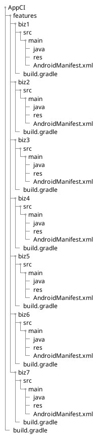
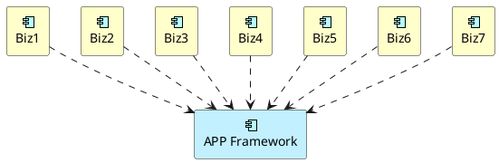
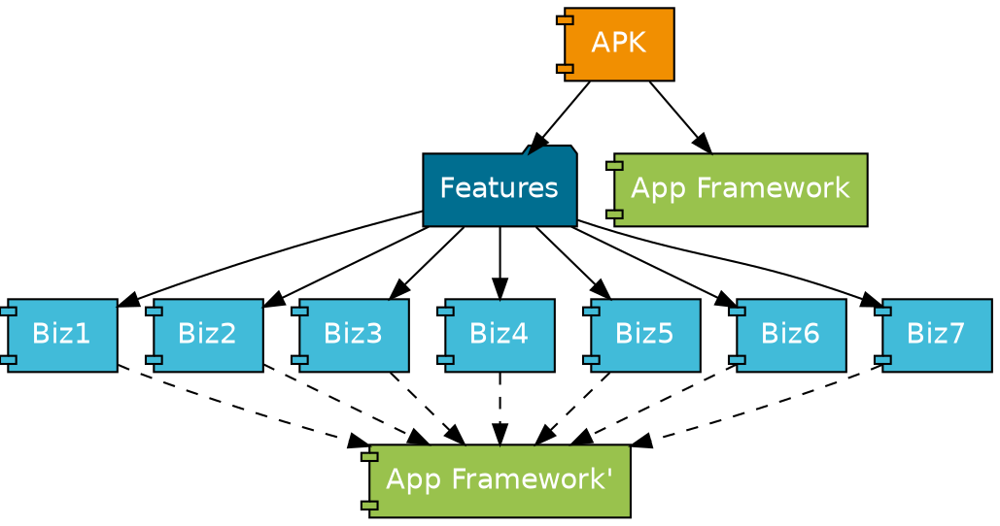

> This story is entirely fictional. Any resemblance to real events is purely coincidental.

I was in the middle of step-debugging when a notification popped up in the corner: "Sen-ge, candidate XXX is at the front desk." Only then did I remember there was an interview that afternoon. I quickly glanced at the resume -- oh, a woman! There was even a photo on it. "Looks about average," I thought. I headed to the front desk to pick her up. The moment the team chat heard a woman was coming in for an interview, it blew up.

"Sen-ge, how would you rate her?" someone pinged me in the group.

Everyone waited with bated breath. "7.5+ I'd say," I replied.

"Show us! Show us!" the troublemakers started egging on.

So I cropped the photo from her resume and tossed it into the chat.

"Sen-ge, your taste doesn't quite match expectations," someone teased.

"She looks better in person than in the photo, hehe." I'd like to think my aesthetic sense is pretty decent. "If you want to see her, come do the second round -- rare opportunity, haha."

(Based on my years of experience as an interviewer, if the photo isn't particularly striking, I'd suggest leaving it off the resume entirely, haha.)

After nearly an hour of conversation, she was sharp throughout. Three rounds in, everyone agreed she was solid. "She's the one -- she can start next week," I said.

> When interviewing women, what really matters is intellect. Looks might be a bonus but not a deciding factor. Of course, some good-looking candidates with less-than-stellar technical skills somehow make it through rounds one, two, and three. This inadvertently inflates their confidence. The truth is, it's not because they interviewed well -- the earlier interviewers just wanted to give the next interviewer a chance to behold the beauty. (Just kidding...)

## The New Hire's Confusion

The woman I'd interviewed last week started today. The boss assigned me as her mentor. "Get familiar with the dev environment and codebase first," I told her. "We just migrated from ADT to Android Studio. Try getting the project to build. If you run into anything, just come find me."

"Sure, Sen-ge. I'll familiarize myself with the code and come to you if I have questions." She went back to her desk and got to work.

That evening, as I was about to leave, she came over with her laptop, looking bewildered. "Sen-ge, do you have a minute? I can't get the build to work. I've been at it all afternoon and can't figure out why."

"Let me take a look." I took the laptop and checked the environment. Found the issue. "Your `grep` and `sed` commands are wrong. You need to install the GNU versions. Mac OSX defaults to the BSD versions, and the command parameters are different."

She stared at me blankly, apparently not following. I explained further: "Our project uses `grep` and `sed` to modify build scripts during integration. Our CI machines run *CentOS Linux*, so they use GNU-version parameters. But on Mac, `grep` and `sed` are BSD versions, which are incompatible with the GNU versions. So your local scripts aren't modifying things correctly, which is why the build keeps failing."

"But why do we need to modify build scripts?"

"Good question. We use submodules to pull business line source code into the integration project for building. During the build, each business line is built separately, published to the local Maven repository, and then the integration project depends on these local Maven artifacts." She still looked confused, so I drew a diagram: "Here's our project structure. Each business line lives under `AppCI/features/`."

"The integration project's dependency structure looks like this," I continued, drawing as I explained:

"Since there are so many *submodules*, building is extremely slow. And *Gradle* doesn't support multi-process parallel builds, so we use *GNU Makefile* to build multiple business line modules simultaneously, then do the integration build with *App Framework*."

"During development, each business line depends on *App Framework*, and they might each depend on a different version. So before integration, we first need to unify the *App Framework* version -- that's why we need `grep` and `sed`."

It finally clicked for her. At some point, Er-ge had wandered over to see what was going on. Seeing us talking about the build system, he launched into a rant: "I've always felt that using Makefile is kind of anti-human. It's really unfriendly for developers. Why can't we switch to a build approach that's more natural for Java developers?..."

"Yeah, I get what you're saying. Expecting everyone to learn *Makefile* does have a steep learning curve. Let me look into whether there's a better approach."

## AAR Integration

Later, Android officially started supporting AAR-based integration builds, which were significantly more efficient. So we rolled out AAR-based builds across the board. Many developers on the business line side had also just switched from ADT to Android Studio and weren't familiar with Gradle either. What to do? Hand-hold them through it, naturally.

A new version of *App Framework* had just been released when someone asked in the CI chat: "Why does our project explicitly depend on *App Framework* v0.11.3, but the integrated version is v0.12.0?"

"Try running this command: `gradle :app:dependencies` to see what version of *App Framework* the integration project is actually using," I replied. Before long, the person posted a screenshot of the dependency tree. "Looks like another business line depends on v0.12.0, which overrode your v0.11.3 due to Gradle's version resolution."

"How do we fix this?" they asked.

"Hmm, that is a problem," I thought. "If each business line depends on a different version of *App Framework*, the higher version will always win after integration."

"What if, when publishing the business line AAR, we modify the *POM* file to remove the dependency on *App Framework*?" Er-ge suggested.

"Sounds feasible. Let's try it."

(Nowadays, a single `exclude group: "xxx", module: 'xxx'` would solve this in seconds.)

That evening, while waiting in line for dinner, I bumped into Er-ge and asked, "Did your POM-modification approach work?"

"Yeah, I tried it and it does work. But I found a *Gradle* bug in the process -- nearly killed me..."

(To be continued)
