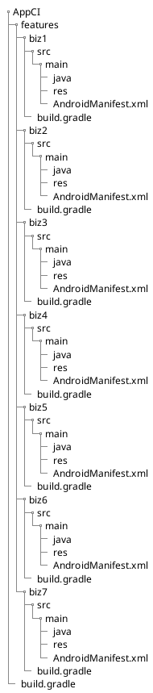
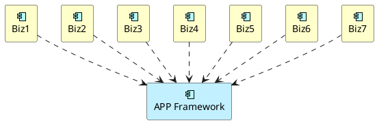
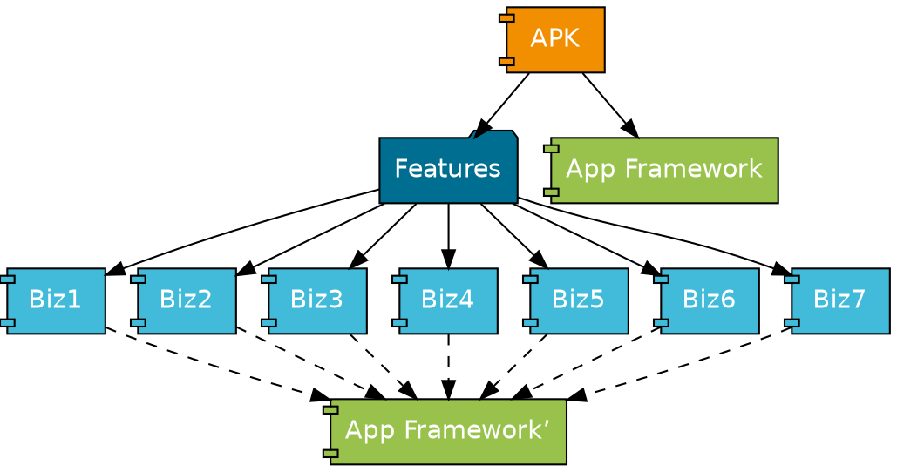

> 本故事纯属虚构，如有雷同，纯属巧合

正在单步 debug 呢，屏幕右上角弹出一条 @ 我的消息：“景森哥，候选人XXX到前台了”，这时才想起来，下午有个面试，于是赶紧瞅了一眼简历，哟呵，还是个妹子呢，简历上还贴了照片，“看起来颜值一般啊”，我心想，于是去前台接人，组内群里听说有妹子来面试了，一下子炸锅了。

“森哥，妹子颜值几分？”，群里有人 @ 我。

大家都满怀期待地等待着，“7.5+ 吧”，我回复道。

“求真相\~求真相\~”，有好事者开始瞎起哄。

于是，我截了简历上的照片往群里一扔。

”森哥，你的审美不太符合预期啊“，有人调侃道。

“真人比照片漂亮，嘿嘿”，我自认我的审美观还算不错的，“想看妹子的来二面啊，机会难得，哈哈哈”。

（据我多年面试官的经验，如果照片不是特别引人注目的那种，我建议简历上还是不要放照片的好，哈哈哈）

近一个小时的面谈，妹子智商都很在线，三轮下来，都觉得靠谱，“就她了，下周就能到岗”，我说道。

> 妹子面试关键还是看智商，颜值可能会是加分项，但不是决定性因素，当然，有的高颜值妹子智商捉急，却能撑过一、二、三面，无形中让妹子自信心膨胀，其实并不是因为面得有多好，只是前面的面试官想给后面的面试官见识一下什么叫高颜值妹子的机会（捂脸〜捂脸〜捂脸〜）

## 新人的困惑

上周面过的妹子今天入职，老大指定我为她的指导老师，我对她说：“你先熟悉一下开发环境和代码吧，我们刚从 ADT 切到 Android Studio，你先把工程跑起来吧，如果有什么问题，直接找我就好了”。

“好的，森哥，我先熟悉一下代码，有问题再来请教你”，说完便回到工位忙活起来。

晚上准备下班的时候，妹子抱着电脑走过来，一脸茫然地问道：“森哥，有空吗？我这边总是编译不过，查了一下午了，也没找出来是什么原因”

“我来帮你看看”，说完，便接过电脑，检查了一下环境，发现了问题所在，“`grep` 和 `sed` 命令不对，你得安装 GNU 的版本，Mac OSX 默认是 BSD 的版本，命令参数不太一样”

妹子一脸懵逼的看着我，貌似没太明白我在说什么，我又解释道：”咱们的工程在集成的时候，会用到 `grep` 和 `sed` 来修改编译脚本，因为咱们集成构建的机器是 *Centos Linux* 系统，所以，用的是 GNU 版本的参数，而 Mac 上的 `grep` 和 `sed` 是 BSD 的版本和 GNU 的版本不兼容，所以，你本地的脚本没有修改对，就会一直编译不过“。

“为什么会要修改构建脚本呢？”

“好问题，因为我们是用的 submodule 的方式将业务线的工程源码放到集成工程里构建的，在构建的时候，会先构建各个业务线，将各个业务线发布到本地 maven 仓库，然后集成工程依赖本地 maven 仓库中的业务线 lib 进行构建”，妹子听完，还是一脸懵逼，我只好画图解释：“这是咱们的工程结构，各个业务线都是在 `AppCI/features/` 下面”。

“集成工程的依赖关系是这样的”，我一边画图一边解释道：

“由于 *submodule* 比较多，构建起来非常慢，而且，*Gradle* 不支持多进程并行构建，所以，我们用 *GNU Makefile* 来实现多个业务线模块同时构建，然后，再跟 *App Framework* 进行集成构建”

“业务线在开发过程中，会依赖 *App Framework* ，可能每个业务线依赖的 *App Framework* 的版本还不一样，所以，在集成之前，先要统一 *App Framework* 的版本，这就是为什么需要 `grep` 和 `sed` 的原因”

妹子恍然大悟，不知道什么时候，二哥过来凑热闹来了，见我们在说构建的事儿，便开始一顿吐槽：“我就觉得用 Makefile 有点反人类，对开发者很不友好，为什么不换成对 Java 开发者友好的构建方式呢？。。。。。。”

“嗯，我能理解你说的这个问题，让大家都去学习 *Makefile* 确实学习曲线有点陡，我再研究一下看看有没有更好的方式吧”

## AAR 集成

后来，Android 官方开始支持以 AAR 的方式进行集成构建，效率确实高了不少，于是开始全面推行以 AAR 的方式进行构建，业务线那边很多开发者也是刚从 ADT 转到 Android Studio，对 Gradle 也不熟悉，怎么办呢？——只能手摸手的教咯。

*App Framework* 的新版本刚发出去，持续集成群里就有人问：“为什么我们的工程明明依赖的是 *App Framework* v0.11.3，为什么集成后的 *APP Framework* 版本却是 v0.12.0？”

“试试执行一下这个命令：`gradle :app:dependencies` 看看集成工程中依赖的 *App Framework* 的版本是多少”，我回复道。没过一会儿，上面那位同学截了个图，是集成工程的版本依赖，“貌似是别的业务线依赖了 v0.12.0 导致你们依赖的 v0.11.3 被更高的版本覆盖了”

“这个问题怎么解决呢？”，那位同学问道。

“嗯，这确实是个问题”，我心想，“如果每个业务线依赖的 *App Framework* 的版本不一致的话，一旦集成，肯定会有高版本覆盖低版本的情况”

“如果在发布业务线 AAR 的时候，修改 *POM* 文件，把业务线对 *App Framework* 的依赖配置从 *POM* 里删掉呢？”，二哥说道。

“听起来可行，试试看吧”

（这个问题要是搁在现在，一行 `exclude group: "xxx", module: 'xxx'` 分分钟搞定）

晚上排队领晚餐的时候，正好碰见了二哥，我便问道，“你那个改 *POM* 的方案好使么？”

“嗯，我试了一下，确实可行，不过我发现了一个 *Gradle* 的 bug，被坑死了。。。。。。”

（未完待续）
